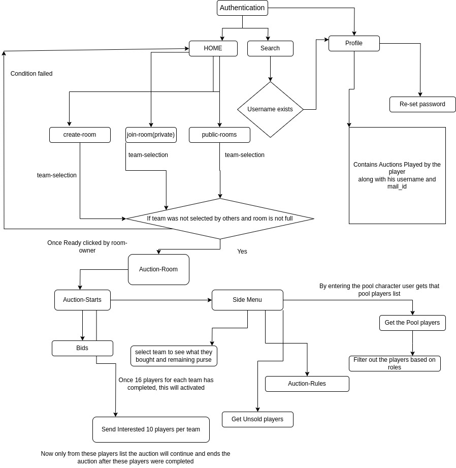

# Auction Application

Building the Application using Rust with Axum the things used in this application was Rest-api , websockets, Graph-ql and Postgress for Primary Storage and Redis for Speed access of the real-time data.

## Below is the Application Flow

## Back-Routes

/authentication/login - Post Url encoded - username and password

/authentication/sign-up Post Url encoded - mail_id , username and password

/authentication/forget-password same but only mail_id

My Next thing was to check whether all Rest API's were implemented or not
along with handlers by cross checking with application sequence diagram.
