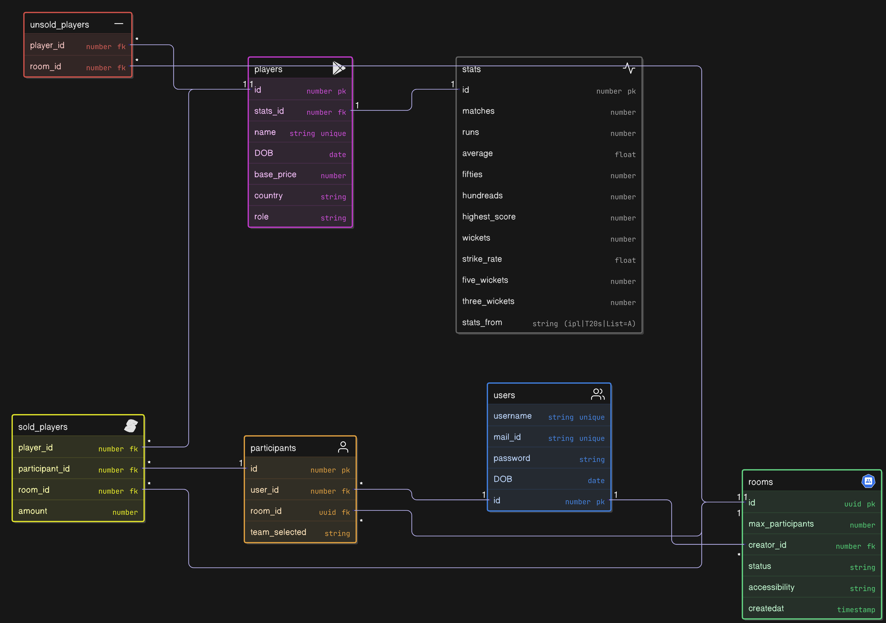

# Auction Application

This application was built using Rust with the Axum framework, incorporating REST APIs, WebSockets, and GraphQL. PostgreSQL serves as the primary data store, while Redis is used to accelerate access to real-time data

## Below is the Application Flow

## Below is the ER Diagram

## Back-End Routes

Authentication-Routes:

These are the Authentication routes for sign-in and sign-up

    /authentication/login - Post Url encoded - username and password
    /authentication/sign-up Post Url encoded - mail_id , username, password
    and DOB.
    return-type :
    {
        Ok : {
            authorization:
        }
    }
    if failed then return-type :
    {
        Err : "represents error"
    }
    /authentication/forget-password same but only mail_id

In Home Page

    -> public-rooms -> /rooms/get-public-rooms
    response :
    {
        Ok : Vec<(Uuid,i32)>, // (containing room-ids,max_participants_allowed)
    }
    if response-fails then :
    {
        Err : String
    }

    [ Way to code front-end for public-rooms

        -> By default each room shows the room-id along with max_players
        -> users can click the room-id and then list of teams that are selected will be appears (/rooms/get-teams/{room_id} GET) it returns the rooms that are been selected , so except those teams make sure the remaining teams to be choosen by marking those selected teams as gray shade by diabling them to click. when user clicks the team. then join-room should be executed.
    ]

    /rooms/get-teams/{room_id} -> returns
    {
        Ok : Vec<String>
    }

    -> create-room -> ws://localhost:9090/ [websocket connection will be created here]
    requested-data :
     {
             authorization_header: String,
             max_players: u8, // 10 IS MAX AND 4 IS MIN
             team: Team,
             room_type: RoomType -> ('PUBLIC' || 'PRIVATE')
     }

    response-data :
    {
        pub room_id: Uuid,
        pub room_type: RoomType, ('PUBLIC', 'PRIVATE')
        pub max_players: u8,
        pub players_teams: Vec<(i32, String)>, (participant_id, team_selected)
        pub status: RoomStatus -> ('WAITING', 'ONGOING','COMPLETED')
    }

    -> join-room -> ws://localhost:9090/ [or here the websocket connection will be created]
    requested-data :
    {
        authorization_header: String,
        room_id: Uuid,
        team_selected: Team // MAKE SURE TEAM-NAME IN CAPITALS
    }

    response-data :
    {
        pub room_id: Uuid,
        pub room_type: RoomType, ('PUBLIC', 'PRIVATE')
        pub max_players: u8,
        pub players_teams: Vec<(i32, String)>, (participant_id, team_selected)
        pub status: RoomStatus -> ('WAITING', 'ONGOING','COMPLETED')
    }

    -> search/:username -> for live username search(sending data via path)
    response-data :
    {
        Ok: Vec<{username, user_id}>
    }

    -> profile -> user/:username returns profile
    return-type:
    {
        username: String,
        mail_id: String,
        favorite_team: String,
        auctions_played: [{room_id: String, date:Date, team_selected:String}]
    }

    -> reset-password inside profile -> user/reset-password
    request: (url-encoded format)
    {
        password: String
    }
    RESPONSE :
    {
        TRUE OR FALSE
    }

In Profile Page:

        Each auction will be listed played by the user. where user can click on the auctions played by them and the list of teams played and the owners(usernames) of the teams will be appeared and each user can click on the team that he wants to see .

        -> rooms/get-teams/{room_id} return teams that participated in the auction along with owners usernames(owners are nothing but users).
        return-type : {
            Ok: Vec<String>
        }
        else :
        {
            Err: ""
        }

        -> rooms/get-team/{room_id}/{team_name} returns team that the players bought by them (only player-id and player name and amount bought for will be returned).
        return-type : {
            Ok: [ {player-id:int, player-name: String, role:String, amount: int} ]
        }

        To get in-detailed player details, the below should be accessed
        -> player/get-player/:player_id (it returns everything except stats,it included stats_id)
        return-type :
           {
               Ok: {player_id, player_name, role, age, stats_id, capped, country}
           }
        else:
        {
            Err: String
        }

        -> player/get-stats/:stats_id (we can get back stats from the stats_id).
        return-type :
        {
            Ok: {
                stats_id, matches, runs, average, fifties, hundreads, wickets,
                strike_rate, five_wickets, three_wickets
            }
        }

        else :
            {
                Err: String
            }

        -> we can also get unsold players of that auction as well using graphql.
        return-type :
        {
            players: {
                player_id, player_name, role
            }
        }

    As this is all we can do in Profile page.

These are all the main-routes and below are the routes that are designed for
inside room-coomunication.

Room Communication with Actual Biddings:

    -> Once every one joined room then, the room-creator can send Ready string via websocket and websocket response with the First Player.
    (with player_id,player_name and base_price).
    sending "Ready" String
    return-type :
    {player_id, player_name, role, age, stats_id, capped, country}

    -> bidding will be taken place, each bid will be sent to the server via websocket and websocket checks whether user has money to buy 18 players after this bid and then adds the bid to the redis and broadcast to the remaining room.
    bid :
    {
        team_name: String, amount_bided: int
    }

    -> once 10 seconds waiting team is over the last bid will taken to consideration and sold to that team and broadcasted to all the room.
    if there is no bid , the player will be sent to unsold.
    request to be sent as "sell" string. (if in redis there is no bid stored goes to unsold)
    bid :
    {
        team_name: String, amount_bided: int, sold: true
    } [ "will be returned" ]

    -> once players has been completed, the Auction room will be ended.

    -> intrested_players was clicked all the players [whom selected as intrested players that are unsold or not came in auction, will be send to the websocket after adding them to hash-set in the front-end it-self to over come duplicates]. (2mins timer for selecting the players they wanted)
    requested-data :
    {
        players : [players_id, ...]
    }

Inside room apart from biddings

    (yet to write routes)
    -> get unsold players using graph ql
    /graphql -> need to send the data that is required

    -> get players list by pool  (/rooms/get-pool/{pool_id} ->

    return-type : {
        Ok : [{id, name, role, base_price},..]
    }
    else
    {
        Err: String
    }

    -> get each team bought players -> (/rooms/get-team/{room_id}/{team_name})

    response-data :
        {
            Ok: [{id, name, role, amount}]
        }

    else
        {
            Err: String
        }

    -> we can add the players in to intrested players list , such that
       those will be re-visited again after the each team has completed buying 16 players. (/rooms/add-to-intrested/{player_id} so at last all players intrested players whom are unsold are not yet came will be sent to the server and stored in the redis).

    -> once each team has completed buying 16 players, the room-creator
    can send a request that continue with the following intrested players instead of the auction-list such that auction will be completed faster.
    ws://localhost:9090/ with all intrested players list in a hash-set to be sent to the websocket.

